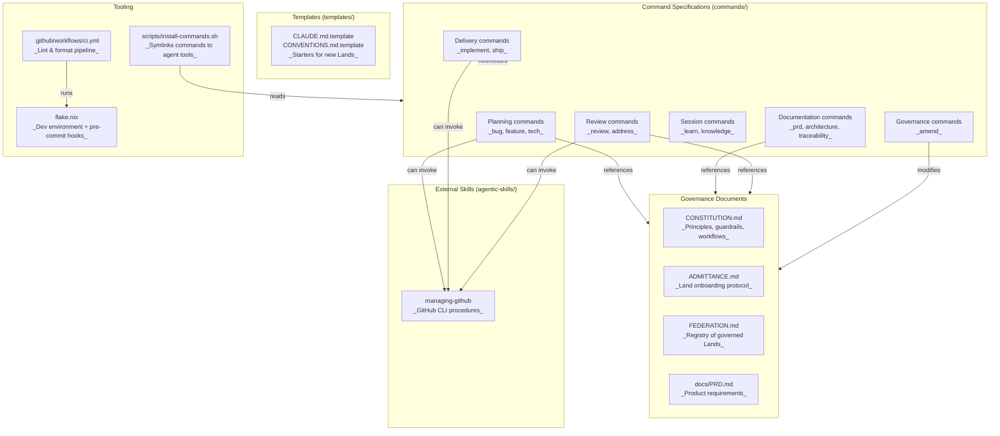

# Architecture

## System Overview

Governance is a documentation-only repository that defines a federated governance
framework for AI-assisted software projects. It contains no application code —
only Markdown specifications, Bash scripts, Nix configuration, and GitHub Actions
workflows. The repository produces two artifacts: agent command specifications
(installed via symlinks into developer tool directories) and governance documents
(consumed by humans and AI agents across multiple projects called "Lands"). Quality
is enforced through Nix-managed pre-commit hooks and a CI pipeline that runs the
same checks.

## Component Diagram



## Dependency Rules

The repository has a flat structure with minimal inter-module dependencies.
The key invariant is a document dependency hierarchy:

```text
CONSTITUTION.md          (top-level authority)
├── ADMITTANCE.md        (references constitution)
├── FEDERATION.md        (references admittance checklist)
├── docs/PRD.md          (references constitution features)
└── commands/*.md        (implement constitution workflows)
    └── templates/*.md.template  (referenced by admittance)
```

**Rules:**

- Command specifications never import or reference other command specifications
  directly. They reference project documents (`CLAUDE.md`, `docs/PRD.md`,
  `docs/ARCHITECTURE.md`, `docs/CONVENTIONS.md`, `docs/TRACEABILITY.md`) in the
  _target_ Land, not in this repository.
- Day-to-day commands (`bug`, `feature`, `tech`, `implement`, `ship`, `review`,
  `address`) never reference governance-repository documents (`CONSTITUTION.md`,
  `FEDERATION.md`, `ADMITTANCE.md`) or federation terminology. They assume only
  the target Land's local context.
- The `amend` command is the only command that references governance-repository
  documents directly.
- Templates reference the constitution for the governance link but are otherwise
  self-contained with placeholder brackets.

## Rules for New Code

1. **New command specs must follow the existing format:** a mode declaration, a
   purpose section, a procedure section, an output format section, and a rules
   section. Do not invent a new structure. _(ADR-1)_

2. **Day-to-day commands must not reference governance documents:** use only the
   target Land's `CLAUDE.md` and `docs/` files. Do not mention `CONSTITUTION.md`,
   `FEDERATION.md`, `ADMITTANCE.md`, or federation terminology. _(ADR-2)_

3. **All Markdown and shell changes must pass pre-commit hooks before merge:**
   markdownlint-cli2, Prettier, ShellCheck, and shfmt. Do not disable or skip
   hooks. _(ADR-3)_

4. **Keep `AGENTS.md` as a symlink to `CLAUDE.md`:** never create a separate
   `AGENTS.md` file. _(ADR-4)_

5. **Use conventional commit messages:** all commits follow the Conventional
   Commits format. _(ADR-5)_

## Where to Put New Code

| I need to...                     | Put it in...                                                        |
| -------------------------------- | ------------------------------------------------------------------- |
| Add a new agent command          | `commands/<name>.md` — then run `install-commands.sh` to symlink it |
| Add a platform-specific skill    | external skill catalog entry for `managing-<platform>`              |
| Add a new project template       | `templates/<name>.md.template`                                      |
| Change governance rules          | `CONSTITUTION.md` (requires explicit user approval)                 |
| Change the admittance process    | `ADMITTANCE.md` (requires explicit user approval)                   |
| Change the federation registry   | `FEDERATION.md` (requires explicit user approval)                   |
| Add a new CI check               | `flake.nix` (add a hook) and verify in `.github/workflows/ci.yml`   |
| Add a new linter config          | Root directory (e.g., `.markdownlint-cli2.jsonc`, `.prettierrc`)    |
| Add a utility script             | `scripts/<name>.sh`                                                 |
| Update product requirements      | `docs/PRD.md`                                                       |
| Store temporary files during dev | `.tmp/` with unique filenames                                       |

## Data Flow

### Command Installation Flow

```text
commands/*.md
     │
     ▼
scripts/install-commands.sh
     │
     ├──► ~/.claude/commands/*.md   (symlinks)
     └──► ~/.codex/prompts/*.md     (symlinks)
```

The script is idempotent: existing correct symlinks are skipped, stale symlinks
are updated, and non-symlink files at the target path are never overwritten.

### Quality Check Flow

```text
Developer commits
     │
     ▼
pre-commit hooks (installed by nix develop / direnv)
     │
     ├──► markdownlint-cli2  (Markdown lint)
     ├──► prettier            (Markdown format)
     ├──► shellcheck          (Shell lint)
     └──► shfmt               (Shell format)
            │
            ▼
       Commit succeeds or fails

PR / push to main
     │
     ▼
GitHub Actions CI (.github/workflows/ci.yml)
     │
     ▼
nix flake check (runs the same hooks)
     │
     ▼
PR merge allowed or blocked
```

### Governance Workflow (across Lands)

```text
Plan phase:  /bug, /feature, /tech  ──►  Issue
                                           │
Implement:                         /implement ──► /ship ──► Draft PR
                                                               │
Review:                                                /review ─┬─► Merge
                                                       /address ◄┘
                                                                    │
Reflect:                                                    /learn, /knowledge
```

Human checkpoints gate the transition from Plan to Implement (issue review) and
from Review to Merge (PR review). The Reflect phase is additive and ungated.

### Entry Points

| Entry point              | How data gets in                                             |
| ------------------------ | ------------------------------------------------------------ |
| `install-commands.sh`    | Developer runs the script manually                           |
| `nix develop` / `direnv` | Developer activates the dev environment                      |
| Pre-commit hooks         | Triggered automatically on `git commit`                      |
| CI pipeline              | Triggered on push to `main` or PR targeting `main`           |
| Agent command invocation | Developer invokes `/command` in Claude Code, Codex, or Junie |

### Storage

| What                       | Where                                                                      |
| -------------------------- | -------------------------------------------------------------------------- |
| Governance documents       | Repository root (`*.md`)                                                   |
| Command specifications     | `commands/*.md`                                                            |
| Templates                  | `templates/*.md.template`                                                  |
| Linter/formatter config    | Root dotfiles (`.markdownlint-cli2.jsonc`, `.prettierrc`, `.editorconfig`) |
| Nix environment definition | `flake.nix`, `flake.lock`                                                  |
| CI configuration           | `.github/workflows/ci.yml`                                                 |
| Temporary dev files        | `.tmp/` (gitignored)                                                       |

### Exit Points

| Exit point     | How data gets out                                                        |
| -------------- | ------------------------------------------------------------------------ |
| Symlinks       | Command specs available in `~/.claude/commands/` and `~/.codex/prompts/` |
| CI status      | Pass/fail reported to GitHub PR checks                                   |
| Agent behavior | Commands shape agent output in target Land repositories                  |
| Templates      | Copied to new Lands during admittance                                    |

## Module Boundary Table

| Module                   | Responsibility                                               | Public API                                                 | Dependencies                  |
| ------------------------ | ------------------------------------------------------------ | ---------------------------------------------------------- | ----------------------------- |
| Governance documents     | Define principles, processes, and federation registry        | `CONSTITUTION.md`, `ADMITTANCE.md`, `FEDERATION.md`        | None                          |
| Product requirements     | Document this repository's own features and success criteria | `docs/PRD.md`                                              | Governance documents          |
| Planning commands        | Interview developer, produce issues                          | `commands/bug.md`, `feature.md`, `tech.md`                 | Target Land's CLAUDE.md, docs |
| Documentation commands   | Generate/update standard project documents                   | `commands/prd.md`, `architecture.md`, `traceability.md`    | Target Land's codebase, docs  |
| Delivery commands        | Implement issues, ship PRs                                   | `commands/implement.md`, `ship.md`                         | Target Land's CLAUDE.md, docs |
| Review commands          | Guide PR review, address comments                            | `commands/review.md`, `address.md`                         | Target Land's CLAUDE.md, docs |
| Session commands         | Capture learnings from work sessions                         | `commands/learn.md`, `knowledge.md`                        | Target Land's CLAUDE.md       |
| Governance commands      | Propose amendments to governance repo                        | `commands/amend.md`                                        | Governance documents          |
| External platform skills | Vendor-specific CLI procedures                               | `managing-github` skill (external catalog)                 | None (reference only)         |
| Templates                | Starter documents for new Lands                              | `templates/CLAUDE.md.template`, `CONVENTIONS.md.template`  | Governance documents (link)   |
| Install script           | Symlink commands into agent tool directories                 | `scripts/install-commands.sh`                              | `commands/`                   |
| Nix environment          | Dev shell with tools and pre-commit hooks                    | `flake.nix`, `flake.lock`                                  | nixpkgs, git-hooks.nix        |
| CI pipeline              | Automated lint and format checks on PR/push                  | `.github/workflows/ci.yml`                                 | Nix environment               |
| Editor/linter config     | Tool configuration for consistent formatting                 | `.editorconfig`, `.prettierrc`, `.markdownlint-cli2.jsonc` | None                          |

## Key Architectural Decisions

### ADR-1: Markdown-Based Command Specifications

**Decision:** Agent commands are plain Markdown files that are symlinked into
agent tool configuration directories.

**Context:** Commands need to be readable by multiple AI agent tools (Claude Code,
Codex, Junie) and editable by both humans and agents. A code-based plugin system
would tie commands to a specific tool.

**Alternatives considered:**

- JSON/YAML config files — rejected because they are harder to read and write for
  both humans and agents, and lack the expressiveness needed for procedural
  instructions.
- Tool-specific plugin formats — rejected because each tool has its own format,
  and the governance framework must work across tools.

**Date:** 2025 (inferred — verify with maintainer)

### ADR-2: Day-to-Day Commands Are Governance-Unaware

**Decision:** Commands like `/bug`, `/feature`, `/implement`, `/ship`, `/review`,
and `/address` never reference governance-repository documents or federation
terminology. They rely only on the target Land's local `CLAUDE.md` and `docs/`.

**Context:** When an agent runs in a target Land, it should not need access to the
governance repository. Commands must be self-contained given the target project's
local documentation. This also prevents coupling between the governance framework
and individual projects.

**Alternatives considered:**

- Having commands fetch governance docs at runtime — rejected because it creates a
  runtime dependency on the governance repo and requires network access.
- Inlining governance rules into each command — rejected because it duplicates
  information and creates a maintenance burden when governance rules change.

**Date:** 2025 (inferred — verify with maintainer)

### ADR-3: Nix-Based Reproducible Toolchain

**Decision:** Use a Nix flake to provide the development environment, pre-commit
hooks, and all linting/formatting tools.

**Context:** The repository needs consistent tooling across developer machines and
CI. Nix provides hermetic, reproducible environments. The `git-hooks.nix` flake
input generates pre-commit configuration automatically, and the same hooks run in
CI via `nix flake check`.

**Alternatives considered:**

- npm/Node.js toolchain — rejected because this is not a JavaScript project, and
  adding a Node runtime for Markdown tooling adds unnecessary complexity.
- Manual tool installation with version pinning — rejected because it relies on
  developers maintaining consistent tool versions, which is exactly the kind of
  drift governance aims to prevent.

**Date:** 2025 (inferred — verify with maintainer)

### ADR-4: Symlink-Based Command Distribution

**Decision:** `install-commands.sh` creates symlinks from `commands/*.md` to agent
tool directories (`~/.claude/commands/`, `~/.codex/prompts/`), rather than copying
files.

**Context:** When command specs are edited in the governance repository, the
changes must propagate immediately to all tools without re-running an install
step. Symlinks achieve this automatically.

**Alternatives considered:**

- File copying with a watcher — rejected because it requires a running process and
  adds complexity.
- Git submodules in each Land — rejected because it couples each Land's repository
  to the governance repo's Git history and requires submodule update discipline.

**Date:** 2025 (inferred — verify with maintainer)

### ADR-5: Infrastructure-Agnostic Command Specifications

**Decision:** Command specifications use generic terms for source code hosting,
issue tracking, and CI/CD. Platform-specific procedures live in dedicated
skills (e.g., the `managing-github` skill).

**Context:** Governed Lands may use different platforms (GitHub, GitLab, YouTrack,
etc.). Commands read the target Land's `CLAUDE.md` Infrastructure section to
determine which CLI or API to use. This separates "what to do" (command spec) from
"how to do it on this platform" (skill + Land config).

**Alternatives considered:**

- Hardcoding GitHub CLI commands into all specs — rejected because it prevents
  adoption by projects on other platforms.
- Abstract adapter layer in code — rejected because this is a documentation
  project, not a software application. The "adapter" is the Land's `CLAUDE.md`
  declaration.

**Date:** 2025 (inferred — verify with maintainer)

### ADR-6: Single-File Agent Instructions with Symlink Alias

**Decision:** Each project maintains `CLAUDE.md` as the canonical agent
instructions file and keeps `AGENTS.md` as a symlink to it.

**Context:** Different AI tools look for different filenames (`CLAUDE.md` for
Claude Code, `AGENTS.md` for other tools). A symlink ensures both tools find the
same content without duplication or drift.

**Alternatives considered:**

- Maintaining two separate files — rejected because content would inevitably
  diverge.
- Using only one filename — rejected because it would break compatibility with
  tools that expect the other filename.

**Date:** 2025 (inferred — verify with maintainer)
