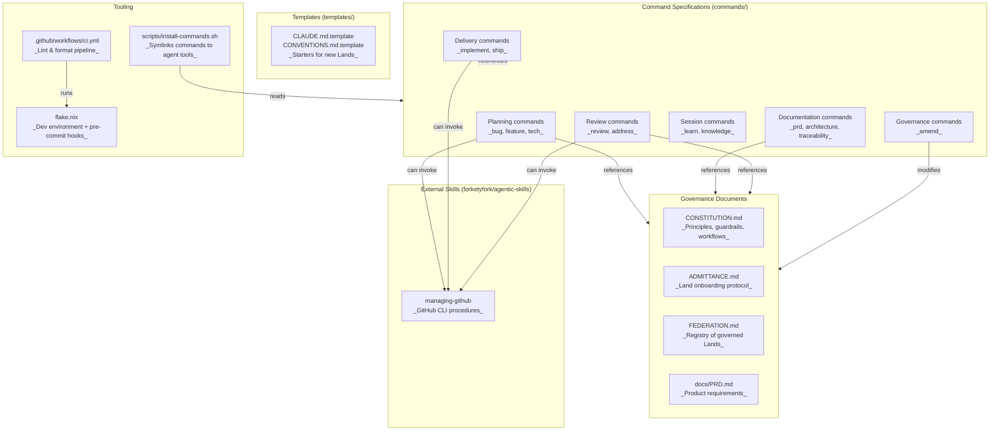

# Architecture

## System Overview

Governance is a documentation-only repository that defines a federated governance
framework for AI-assisted software projects. It contains no application code —
only Markdown specifications, Bash scripts, Nix configuration, and GitHub Actions
workflows. The repository produces two artifacts: agent command specifications
(installed via symlinks into developer tool directories) and governance documents
(consumed by humans and AI agents across multiple projects called "Lands"). Quality
is enforced through Nix-managed pre-commit hooks and a CI pipeline that runs the
same checks.

## Component Diagram


```mermaid
graph TD
    subgraph governance["Governance Documents"]
        CONST["CONSTITUTION.md\n_Principles, guardrails, workflows_"]
        ADMIT["ADMITTANCE.md\n_Land onboarding protocol_"]
        FED["FEDERATION.md\n_Registry of governed Lands_"]
        PRD["docs/PRD.md\n_Product requirements_"]
    end

    subgraph commands["Command Specifications (commands/)"]
        PLAN["Planning commands\n_bug, feature, tech_"]
        DOC["Documentation commands\n_prd, architecture, traceability_"]
        IMPL["Delivery commands\n_implement, ship_"]
        REV["Review commands\n_review, address_"]
        SESS["Session commands\n_learn, knowledge_"]
        GOV["Governance commands\n_amend_"]
    end

    subgraph skills["External Skills (forketyfork/agentic-skills)"]
        GH["managing-github\n_GitHub CLI procedures_"]
    end

    subgraph templates["Templates (templates/)"]
        TMPL["CLAUDE.md.template\nCONVENTIONS.md.template\n_Starters for new Lands_"]
    end

    subgraph tooling["Tooling"]
        INSTALL["scripts/install-commands.sh\n_Symlinks commands to agent tools_"]
        NIX["flake.nix\n_Dev environment + pre-commit hooks_"]
        CI[".github/workflows/ci.yml\n_Lint & format pipeline_"]
    end

    INSTALL -->|reads| commands
    CI -->|runs| NIX
    PLAN -->|references| governance
    DOC -->|references| governance
    REV -->|references| governance
    GOV -->|modifies| governance
    IMPL -->|references| commands
    PLAN -->|can invoke| GH
    IMPL -->|can invoke| GH
    REV -->|can invoke| GH
```

## Dependency Rules

The repository has a flat structure with minimal inter-module dependencies.
The key invariant is a document dependency hierarchy:

```text
CONSTITUTION.md          (top-level authority)
├── ADMITTANCE.md        (references constitution)
├── FEDERATION.md        (references admittance checklist)
├── docs/PRD.md          (references constitution features)
└── commands/*.md        (implement constitution workflows)
    └── templates/*.md.template  (referenced by admittance)
```

**Rules:**

- Command specifications never import or reference other command specifications
  directly. They reference project documents (`CLAUDE.md`, `docs/PRD.md`,
  `docs/ARCHITECTURE.md`, `docs/CONVENTIONS.md`, `docs/TRACEABILITY.md`) in the
  _target_ Land, not in this repository.
- Day-to-day commands (`bug`, `feature`, `tech`, `implement`, `ship`, `review`,
  `address`) never reference governance-repository documents (`CONSTITUTION.md`,
  `FEDERATION.md`, `ADMITTANCE.md`) or federation terminology. They assume only
  the target Land's local context.
- The `amend` command is the only command that references governance-repository
  documents directly.
- Templates reference the constitution for the governance link but are otherwise
  self-contained with placeholder brackets.

## Rules for New Code

1. **New command specs must follow the existing format:** a mode declaration, a
   purpose section, a procedure section, an output format section, and a rules
   section. Do not invent a new structure. _(DR-001)_

2. **Day-to-day commands must not reference governance documents:** use only the
   target Land's `CLAUDE.md` and `docs/` files. Do not mention `CONSTITUTION.md`,
   `FEDERATION.md`, `ADMITTANCE.md`, or federation terminology. _(DR-002)_

3. **All Markdown and shell changes must pass pre-commit hooks before merge:**
   markdownlint-cli2, Prettier, ShellCheck, and shfmt. Do not disable or skip
   hooks. _(DR-003)_

4. **Keep `AGENTS.md` as a symlink to `CLAUDE.md`:** never create a separate
   `AGENTS.md` file. _(DR-006)_

5. **Use conventional commit messages:** all commits follow the Conventional
   Commits format. _(DR-007)_

## Where to Put New Code

| I need to...                     | Put it in...                                                        |
| -------------------------------- | ------------------------------------------------------------------- |
| Add a new agent command          | `commands/<name>.md` — then run `install-commands.sh` to symlink it |
| Add a platform-specific skill    | external skill catalog entry for `managing-<platform>`              |
| Add a new project template       | `templates/<name>.md.template`                                      |
| Change governance rules          | `CONSTITUTION.md` (requires explicit user approval)                 |
| Change the admittance process    | `ADMITTANCE.md` (requires explicit user approval)                   |
| Change the federation registry   | `FEDERATION.md` (requires explicit user approval)                   |
| Add a new CI check               | `flake.nix` (add a hook) and verify in `.github/workflows/ci.yml`   |
| Add a new linter config          | Root directory (e.g., `.markdownlint-cli2.jsonc`, `.prettierrc`)    |
| Add a utility script             | `scripts/<name>.sh`                                                 |
| Update product requirements      | `docs/PRD.md`                                                       |
| Store temporary files during dev | `.tmp/` with unique filenames                                       |

## Data Flow

### Command Installation Flow

```text
commands/*.md
     │
     ▼
scripts/install-commands.sh
     │
     ├──► ~/.claude/commands/*.md   (symlinks)
     └──► ~/.codex/prompts/*.md     (symlinks)
```

The script is idempotent: existing correct symlinks are skipped, stale symlinks
are updated, and non-symlink files at the target path are never overwritten.

### Quality Check Flow

```text
Developer commits
     │
     ▼
pre-commit hooks (installed by nix develop / direnv)
     │
     ├──► markdownlint-cli2  (Markdown lint)
     ├──► prettier            (Markdown format)
     ├──► shellcheck          (Shell lint)
     └──► shfmt               (Shell format)
            │
            ▼
       Commit succeeds or fails

PR / push to main
     │
     ▼
GitHub Actions CI (.github/workflows/ci.yml)
     │
     ▼
nix flake check (runs the same hooks)
     │
     ▼
PR merge allowed or blocked
```

### Governance Workflow (across Lands)

```text
Plan phase:  /bug, /feature, /tech  ──►  Issue
                                           │
Implement:                         /implement ──► /ship ──► Draft PR
                                                               │
Review:                                                /review ─┬─► Merge
                                                       /address ◄┘
                                                                    │
Reflect:                                                    /learn, /knowledge
```

Human checkpoints gate the transition from Plan to Implement (issue review) and
from Review to Merge (PR review). The Reflect phase is additive and ungated.

### Entry Points

| Entry point              | How data gets in                                             |
| ------------------------ | ------------------------------------------------------------ |
| `install-commands.sh`    | Developer runs the script manually                           |
| `nix develop` / `direnv` | Developer activates the dev environment                      |
| Pre-commit hooks         | Triggered automatically on `git commit`                      |
| CI pipeline              | Triggered on push to `main` or PR targeting `main`           |
| Agent command invocation | Developer invokes `/command` in Claude Code, Codex, or Junie |

### Storage

| What                       | Where                                                                      |
| -------------------------- | -------------------------------------------------------------------------- |
| Governance documents       | Repository root (`*.md`)                                                   |
| Command specifications     | `commands/*.md`                                                            |
| Templates                  | `templates/*.md.template`                                                  |
| Linter/formatter config    | Root dotfiles (`.markdownlint-cli2.jsonc`, `.prettierrc`, `.editorconfig`) |
| Nix environment definition | `flake.nix`, `flake.lock`                                                  |
| CI configuration           | `.github/workflows/ci.yml`                                                 |
| Temporary dev files        | `.tmp/` (gitignored)                                                       |

### Exit Points

| Exit point     | How data gets out                                                        |
| -------------- | ------------------------------------------------------------------------ |
| Symlinks       | Command specs available in `~/.claude/commands/` and `~/.codex/prompts/` |
| CI status      | Pass/fail reported to GitHub PR checks                                   |
| Agent behavior | Commands shape agent output in target Land repositories                  |
| Templates      | Copied to new Lands during admittance                                    |

## Module Boundary Table

| Module                   | Responsibility                                               | Public API                                                 | Dependencies                  |
| ------------------------ | ------------------------------------------------------------ | ---------------------------------------------------------- | ----------------------------- |
| Governance documents     | Define principles, processes, and federation registry        | `CONSTITUTION.md`, `ADMITTANCE.md`, `FEDERATION.md`        | None                          |
| Product requirements     | Document this repository's own features and success criteria | `docs/PRD.md`                                              | Governance documents          |
| Planning commands        | Interview developer, produce issues                          | `commands/bug.md`, `feature.md`, `tech.md`                 | Target Land's CLAUDE.md, docs |
| Documentation commands   | Generate/update standard project documents                   | `commands/prd.md`, `architecture.md`, `traceability.md`    | Target Land's codebase, docs  |
| Delivery commands        | Implement issues, ship PRs                                   | `commands/implement.md`, `ship.md`                         | Target Land's CLAUDE.md, docs |
| Review commands          | Guide PR review, address comments                            | `commands/review.md`, `address.md`                         | Target Land's CLAUDE.md, docs |
| Session commands         | Capture learnings from work sessions                         | `commands/learn.md`, `knowledge.md`                        | Target Land's CLAUDE.md       |
| Governance commands      | Propose amendments to governance repo                        | `commands/amend.md`                                        | Governance documents          |
| External platform skills | Vendor-specific CLI procedures                               | `managing-github` skill (external catalog)                 | None (reference only)         |
| Templates                | Starter documents for new Lands                              | `templates/CLAUDE.md.template`, `CONVENTIONS.md.template`  | Governance documents (link)   |
| Install script           | Symlink commands into agent tool directories                 | `scripts/install-commands.sh`                              | `commands/`                   |
| Nix environment          | Dev shell with tools and pre-commit hooks                    | `flake.nix`, `flake.lock`                                  | nixpkgs, git-hooks.nix        |
| CI pipeline              | Automated lint and format checks on PR/push                  | `.github/workflows/ci.yml`                                 | Nix environment               |
| Editor/linter config     | Tool configuration for consistent formatting                 | `.editorconfig`, `.prettierrc`, `.markdownlint-cli2.jsonc` | None                          |

## Key Architectural Decisions

Decision details are stored in `docs/decisions/` and summarized here.

| ID       | Title                                             | Status   | Date       | Link                                                                                                                                                |
| -------- | ------------------------------------------------- | -------- | ---------- | --------------------------------------------------------------------------------------------------------------------------------------------------- |
| `DR-001` | Markdown-based command specifications             | Accepted | 2026-02-16 | [docs/decisions/DR-001-markdown-based-command-specifications.md](decisions/DR-001-markdown-based-command-specifications.md)                         |
| `DR-002` | Day-to-day commands are governance-unaware        | Accepted | 2026-02-16 | [docs/decisions/DR-002-day-to-day-commands-are-governance-unaware.md](decisions/DR-002-day-to-day-commands-are-governance-unaware.md)               |
| `DR-003` | Nix-based reproducible toolchain                  | Accepted | 2026-02-16 | [docs/decisions/DR-003-nix-based-reproducible-toolchain.md](decisions/DR-003-nix-based-reproducible-toolchain.md)                                   |
| `DR-004` | Symlink-based command distribution                | Accepted | 2026-02-16 | [docs/decisions/DR-004-symlink-based-command-distribution.md](decisions/DR-004-symlink-based-command-distribution.md)                               |
| `DR-005` | Infrastructure-agnostic command specifications    | Accepted | 2026-02-16 | [docs/decisions/DR-005-infrastructure-agnostic-command-specifications.md](decisions/DR-005-infrastructure-agnostic-command-specifications.md)       |
| `DR-006` | Single-file agent instructions with symlink alias | Accepted | 2026-02-16 | [docs/decisions/DR-006-single-file-agent-instructions-with-symlink-alias.md](decisions/DR-006-single-file-agent-instructions-with-symlink-alias.md) |
| `DR-007` | Conventional commit messages                      | Accepted | 2026-03-05 | [docs/decisions/DR-007-conventional-commit-messages.md](decisions/DR-007-conventional-commit-messages.md)                                           |
